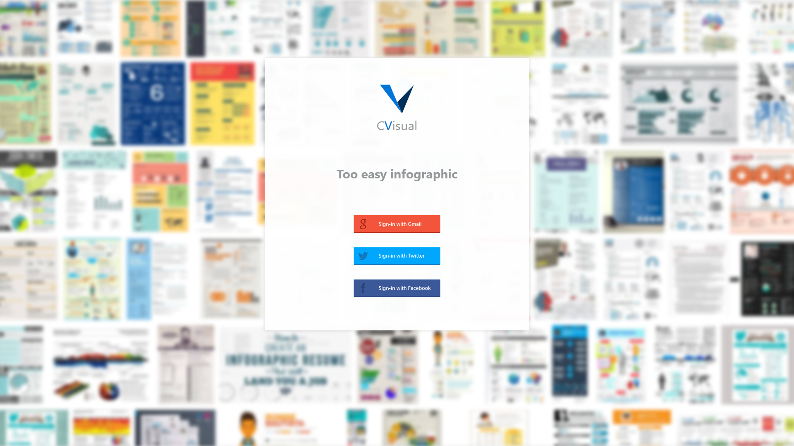

# Infographic-resume (CVisual)
이력서 정보를 입력해 두면, 여러개의 인포그래픽 이력서를 만들어주는 서비스

* 인포그래픽에 사용될 그래픽요소 편집 기능
* 인포그래픽 템플릿 편집 기능

## 사용(될) 기술
* React or Angular
* Typescript
* webpack
* firebase
* JWT
* GraphQL
* bootstrap or reactstrap
* styled-compoents or less or sass

## 기획

## 디자인 프로토타이핑 (작업중)

### logo

### login page

### header page

